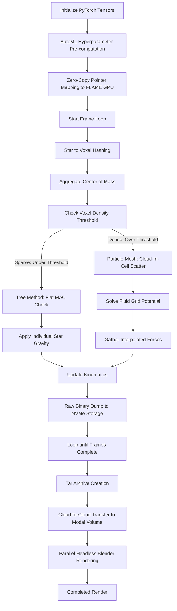

## Table of Contents
- [Overview](#overview)
- [Methods](#methods)
- [Motivation](#motivation)
- [Hardware Benchmarking & Performance Profiling](#hardware-benchmarking--performance-profiling)
- [Pipeline Overhead Profiling](#pipeline-overhead-profiling)
- [Bill of Materials](#bill-of-materials)
- [Next Steps](#next-steps)
- [Quick Start](#quick-start)

## Overview
Gravitation influence for N-bodies is an `$O(N^2)$` computation per time step. This is because each body is attracted to every other body. This quickly grows in the compute required. For this reason, for Compoxel, I implemented two separate algorithms, and combined them to make a third hybrid algorithm.

I don't have the GPUs required for the project at home (the simulation was run on T4 GPUs and the rendering was run on 10 T4s in parallel), so I used cloud computing on Modal for rendering, Colab where possible and Runpod for one part of the display simulation. Due to the gravity calculation being identical for each entity in the simulation, I did not have to deal with warp divergence (there is no branching if branches aren't created), and thus did not have to deal with a memory layer (for my next project, I will be dealing with a memory layer).

### Sample Rendering
10 million entities. Originally, I wanted it to be the collision of a spiral galaxy and a cluster galaxy, but the formation of spiral galaxies is not just reliant on gravity, so my engine would not be able to simulate it yet. (Requires fluid dynamics which is the next step). This is the collision of two cluster galaxies, each with about 5 million entities. 
- I had to bring the camera back significantly to fit everything in frame for the entirety of the video, so the collision is not seen in great detail. 
- To stop me from needing to download large videos into Github, all video files are links to the posted version on youtube. 

Full Render: 

<a href="https://www.youtube.com/watch?v=eKMynsMQN3g">
  
</a>

Per Frame Compute Times: 

<a href="https://www.youtube.com/watch?v=AsgClwaiMt4"></a>

### Sample Side by Side Rendering 
- 500k entities using all 4 methods. Initial Conditions (IC) are the same. Simulation run on one T4, Rendering run using Blender on 10 T4s concurrently. (Exported as a zip file with 4 .abc (alembic) files, rendered on Modal) 

MESH

<a href="https://youtu.be/TaAkhnfE6QY"></a>

TREE

<a href="https://youtu.be/SqGI0A2BPOA"></a>

NAIVE 

<a href="https://youtu.be/U3uTejKxo_I"></a>

HYBRID

<a href="https://youtu.be/-_pIDW-e5PA"></a>
Overlayed Graphs of time per frame for each method

<a href="https://youtu.be/hd1ui1vHk0g"></a>

- The colors are not kept constant for each particle in each frame (it is randomly assigned on each frame), this leads to the color flickering you can see in the hybrid method. 

- Something interesting to notice is the different behaviors of each method. Note that the Naive method is the most accurate, it is essentially what would occur. 
  - The naive render looks pretty stable (none of the particles are ejected from the render (more or less)), this is essentially what we are trying to replicate in the other simulations
- The Hybrid approach shoots out of frame. I think this is because the P3D is not tuned properly, and I would be able to get something similar to the naive approach with much better performance. (I could put the P3D to the max and it would be the same as the naive method, but then its not really optimized) 
- In the tree approach, at second 2 and 3, you can slightly see the voxels breaking up. This is because the MAC criteria leads to more exact calculations bringing entities together, while things outside the voxel (and the MAC figure), are calculated using rough Tree calculations, so they get thrown far away from the voxel. 
  - After more research, I found out this is called "Grid Anisotropy" 
- Very interestingly, the mesh and the hybrid approach have very similar behaviors at the start, so my best guess is the hybrid is using the mesh because there are lots of entities (I need to change the is dense threshold) 
  - The majority of what we can see is controlled by the mesh algorithm (it controls stars when they are dense, which is also when they are brightest), so even if there was a portion controlled by the tree algorithm, we would not be able to see it very clearly. 

- The first frames of the hybrid method take much much longer than the other approaches, this is because the hybrid approach takes a long time to set up (I explain this more further in this README) 
  - The tree method also takes a lot of time to set up, which is why there is a large increase in per frame render time. The mesh method requires less set up, resulting in a smaller spike. Finally, the naive method requires basically nothing to set up (apart from the CUDA compilation), which is why it is basically constant throughout the simulation. 


### Terminology & Definitions
*   **N-body Simulation:** A computational engine that models the dynamic, individual interactions of a large number of particles (bodies) under the influence of physical forces, such as gravity (this is the only one that Compoxel v1.0.0 can handle)
*   **Voxel:** In Compoxel, voxels are subdivisions of the physical simulation space used to cluster nearby stars together (there are different voxel sizes, read more in the parameters section).
*   **MAC (Multipole Acceptance Criterion):** A mathematical threshold used in the Tree algorithm to determine if a distant voxel is far enough away to be safely approximated as a single "center of mass," or if it is too close and requires exact star-to-star calculation.
*   **Warp Divergence:** A hardware performance penalty that occurs when GPU threads within the same execution block (warp) take different logical paths (e.g., if/else branches). The GPU is forced to execute these paths sequentially, destroying parallel efficiency. Note that I am using Nvidia GPUs only (that's what FlameGPU is built on), which is why they are called warps. For different GPU brands (like AMD GPUs, it is called a wavefront instead)
*   **Cache Thrashing:** Occurs when the GPU has to find the memory location of something in the memory rather than having it be contiguous.
*   **JIT (Just-In-Time) Compilation:** The process of compiling source code into executable GPU machine code right at the moment the script is executed, rather than pre-compiling it beforehand.

## Methods
All simulations were run under identical starting conditions instantiated with the Torch Random seed 42 (the answer to everything!).

### Parameters
#### Environment
| Parameter Name | Description | Value | Additional Information |
| :--- | :--- | :--- | :--- |
| **Bounding Box Domain** | Spatial simulation volume boundaries | $[-15.0, 15.0]^3$| Total domain volume = $27,000\text{ units}^3$|
| **Integration Timestep ($\Delta t$)** | Time delta calculated per simulation step | `0.05`| Fixed timestep size|
| **Gravitational Constant ($G$)** | Global gravitational force multiplier | `0.0001`| Scaled gravitational constant for stability|
| **Softening Factor ($\epsilon^2$)** | Parameter added to distance denominator to prevent division by zero | `0.1` / `0.001`| `0.1` for direct force math; `0.001` for P3M short-range correction. If two entities were basically on top of each other, the force would approach infinity, so this had to change|


#### Simulation Configuration for 10 million entities
| Parameter Name | Description | Value | Additional Information |
| :--- | :--- | :--- | :--- |
| **Total Entities ($N$)** | Total number of simulated star particles | `10,000,000`| Collision setup between two cluster galaxies|
| **MAC Threshold ($\theta$)** | Multipole Acceptance Criterion threshold | `1.0`| Controls center-of-mass approximation distance check. Controls how far away an entity must be for the gravity approximation to be used.|
| **Level 1 (L1) Tree Layer** | Base level voxel dimensions | Size: `1.0`, Grid: $30 \times 30 \times 30$| $27,000$ total L1 voxels|
| **Level 2 (L2) Tree Layer** | Mid-level tree voxel dimensions | Size: `5.0`, Grid: $6 \times 6 \times 6$| $216$ total L2 voxels|
| **Level 3 (L3) Tree Layer** | Top-level tree voxel dimensions | Size: `15.0`, Grid: $2 \times 2 \times 2$| $8$ total L3 voxels|
| **Dense Threshold ($N_{\text{crit}}$)** | Dynamic density switch threshold | `2,000` stars| Triggers PM fluid solver if an L1 voxel exceeds 2,000 stars. The other voxels cannot exceed the dense threshold because they only contain the voxels smaller than it. And they cannot contain more than 2000 of the voxel under it (the set up makes it impossible). |
| **Mesh Resolution Multiplier** | PM nodes per L1 voxel dimension | `3`| Subdivides L1 voxels into fluid nodes|
| **Global Mesh Grid Dimension** | Resolution of the full PM field | $90 \times 90 \times 90$| $729,000$ total fluid nodes ($30 \times 3$)|
| **Mesh Cell Size** | Physical width of an individual PM cell | `0.3333` units| Calculated as $\text{L1 Voxel Size} / \text{Mesh Resolution}$ ($1.0 / 3$)|
| **Cutoff Radius ($r_c$)** | Short-range P3M cutoff distance | `1.0` units| Same as the voxel size so we don't need to do too  many naive calculations|
| **Total Simulated Frames** | Total output frame count | `500`| Total length of the rendered sequence|

#### Simulation Configuration for 500 thousand entities
| Parameter Name | Description | Value | Additional Information |
| :--- | :--- | :--- | :--- |
| **Total Entities ($N$)** | Total number of simulated star particles | `500,000`| Dataset size used for side-by-side algorithm comparison|
| **MAC Threshold ($\theta$)** | Multipole Acceptance Criterion threshold | `1.0`| Controls center-of-mass approximation distance check. Controls how far away an entity must be for the gravity approximation to be used.|
| **Level 1 (L1) Tree Layer** | Base level voxel dimensions | Size: `5.0`, Grid: $6 \times 6 \times 6$| $216$ total L1 voxels|
| **Level 2 (L2) Tree Layer** | Top-level tree voxel dimensions | Size: `15.0`, Grid: $2 \times 2 \times 2$| $8$ total L2 voxels|
| **Dense Threshold ($N_{\text{crit}}$)** | Dynamic density switch threshold | `1,000` stars| Triggers PM fluid solver if an L1 voxel exceeds 1,000 stars|
| **Mesh Resolution Multiplier** | PM nodes per L1 voxel dimension | `10`| Subdivides L1 voxels into fluid nodes|
| **Global Mesh Grid Dimension** | Resolution of the full PM field | $60 \times 60 \times 60$| $216,000$ total fluid nodes ($6 \times 10$)|
| **Mesh Cell Size** | Physical width of an individual PM cell | `0.50` units| Calculated as $\text{L1 Voxel Size} / \text{Mesh Resolution}$ ($5.0 / 10$)|
| **Cutoff Radius ($r_c$)** | Short-range P3M cutoff distance | `2.0` / `0.25` units| `2.0` for Tree & Hybrid solvers; `0.25` for Pure Mesh|
| **Total Simulated Frames** | Total output frame count | `800`| Total length of the rendered sequence|

### Method 1: The Naive Baseline `$O(N^2)$` 
This is each item calculating the attraction to every other object and applying its force. Doubling the number of entities would quadruple the number of computations.
I used this method to calculate the errors of the other three methods.
This is the most accurate algorithm and is essentially how gravity works physically. However, the time steps in the simulation are discrete whereas it is continuous in the real world.

**Gravitational Softening:** To prevent entities from slingshotting to infinity when they get too close (where the distance `$r$` approaches zero and force approaches infinity), a softening parameter (`$\epsilon^2$`) is injected into the denominator of the force calculation (`$F=G\frac{m_1 m_2}{r^2+\epsilon^2}$`). This mathematically caps the maximum force and maintains simulation stability.

### Method 2: Hierarchical Center of Mass Voxels (Officially called the Tree Method) `$O(N \log N)$` 
This method is adapted from the CPU implementation of the Barnes Hut hierarchical approach. It is better for very sparse space.
The environment is broken down into voxels, starting off with L1 (the smallest) and moving up to larger and larger voxels.
Each larger voxel must be a multiple of the previous voxels size (3 or 4) so that the calculations can occur on it.

When I need to compute the force applied to an entity, I first compute it using the Naive method for nearby entities, then instead of using the Naive method for far things, it calculates the centre of gravity for the voxel and uses that instead. This makes it so that we only need to calculate it for one big chunk instead of many small entities.

We can't use this approximation when it is right next to the entity because gravitational attraction scales/decomposes with respect to distance squared, so we can only use the approximation when it is far enough away. (The approximation is exact when it is an infinite distance away).

When there are too many entities nearby, this method is even worse than naive. There are the same number of computations required as the naive method (if everything is crammed into one little voxel). And, GPU querying structured memory (which is what we have for the tree), is much much slower than GPU querying random memory (which is what the naive baseline is). For this reason, it performs much much worse when there are too many entities.


### Method 3: Force Field (Officially called The Particle-Mesh Field) `$O(N \log N)$` 

When it becomes too dense, the GPU will run the naive N squared loops. To prevent this, a force field method is created.

**Density Trigger:** A voxel (it basically has to be an L1 voxel because the other voxels can't become dense) determines if it is dense enough. If it is, it switches over to the force field method.

**Cloud-In-Cell (CIC) Scattering:** In order to factor in the masses of the stars and where they are in their bounding box (we've split up the voxels into smaller boxes at this point), we use a scattering method which takes into account where it is, and spreads out its mass porportionally to each of the corners of the cube. This "combines" everything together and makes the number of entities that need to be computed constant.

**Direct Mesh Calculation:** A force field for each point is computed, and these are used to move the individuals entities.

This method only works well under certain conditions:
* Stars cannot be too spread out (the voxels cannot be too large), if they are, then there are not enough bounding boxes for it to be accurate, or it will require too much memory to store everything.
* If there are very few stars in a single voxel, then more computations are required for the process. (it splits it up into 8 different entities that are treated like a star). The spreading process also takes another layer.

### Method 4: Hybrid Method (Force Field Voxels!) `$O(N \log N)$`

This combines methods 2 and 3 together to create an architecture that scales efficiently in all situations. Instead of breaking down under extreme density, the Hybrid method uses a dynamic density heuristic (IS_DENSE). If an L1 voxel detects too many entities, it seamlessly routes those specific GPU warps to the Particle-Mesh (fluid grid) solver. Sparse regions continue to use the Tree method. This prevents the GPU from falling back to `$O(N^2)$` brute-force math and completely eliminates warp divergence in galactic cores.

## Motivation
Originally, this project was meant to be a computational chemistry engine, however, FlameGPU can only work with discrete objects, while electrons are probablistic. While I could have switched to a ball and stick representation and going one step out (so I only look at the classical atoms instead of the quantum electrons), I wanted to see emergent wavefunctions, so this was not the right tool for it. For this reason, I switched to something else that I am very passionate about, which is astronomy, which has much larger classical objects, and also have deterministic rules governing their behavior.

## Hardware Benchmarking & Performance Profiling
To ensure accurate figures of per frame generation time, I first generated two frames to allow the GPU to "warm up", then generated 6 frames and averaged them out to get the final figure.

The GPU requires time to "warm up" because when idling, the PCIe slot (the data transfer mechanism from the CPU to the GPU) throttles to save power and reduce heat (these are called p-states, with P0 being where we're trying to get to, and P12 being where we're starting). It takes time to for the PCIe slot to transfer at a normal speed, two uncounted frames ensure it is at high utilization before benchmarking occurs. 
Additionally, FlameGPU compiles the code when it runs (JIT compilation), so the first frame is much slower to compile all the code, memory is also allocated on the first frame. 
- Essentially, I am trying to remove all of the time spent not doing computations from this benchmark.
  


All benchmarks were standardized on NVIDIA T4 GPUs (using Modal) 
### Average Time Taken per Frame
| Particle Count ($N$) | Naive (ms) | Tree (ms) | Pure Mesh (ms) | Hybrid TreePM (ms) |
| :--- | :--- | :--- | :--- | :--- |
| **100,000** | 130.25 | 185.21 | 158.87 | 164.54 |
| **500,000** | 3059.95 | 848.86 | 708.16 | 868.93 |
| **1,000,000** | 11815.10 | 1,783.50 | 1474.25 | 2264.61 |
| **5,000,000** | 264285.20 | 27271.80 | 19512.37 | 50441.12 |
| **10,000,000** | DNF (Timeout) | 96985.15 | 63649.05 | 209969.00 |

### Empirical Curve Fitting


The curve fitting was performed using scipy. The following time complexities were provided to scipy to fit to, the one with the lowest `$R^2$` value is chosen to be the empirical time complexity of the method: `$O(N)$`, `$O(N^2)$`, `$O(\log N)$`, `$O(N \log N)$`.

Something interesting seen from this graph and the fit curves are the exact `$R^2$` values for each method.
- There is no initial set up time for the naive method, and this perfectly fits the curve: the compute time scales flawlessly with the number of entities.
- The force field method requires some setup, so it deviates slightly from the curve if compute was the only consideration. The voxel method requires far more time to set up, because it has to break the space down multiple times, resulting in longer setup times. This appears in the graph as a larger deviation from the theoretical curve-which represents the ideal scenario if pure compute was the only factor.
- Finally, the hybrid method requires about as much setup as the force field and voxel methods combined. This results in a far larger deviation from the line of best fit (note that `$R^2$` is not linear so the deviation does not scale linearly to time).

### Error Figures and Accuracy Data across methods 
The naive method is the method that is closest to reality (the only difference is it operates in discrete time steps while the universe runs in continuous time steps). 
Here are the different metrics that are being computed: 
- Global MSE: Average positional deviation
- 99th percentile error (P99): The positional error of the worst 1% of stars (in our simulation, this would usually be the stars in the dense core, because that's where the approximations break down) 
- Maximum Absolute Error (MAE): The absolute max distance that a star is from its true position over the entire simulation (caused by a star getting thrown into the abyss) 

| Particle Count | Algorithm | Global MSE | P99 Error | Max Absolute Error |
| :--- | :--- | :--- | :--- | :--- |
| **100,000** | Tree | 146.40 | 23.16 | 32.36 |
| **100,000** | Mesh | 146.56 | 23.17 | 32.71 |
| **100,000** | Hybrid | 146.56 | 23.16 | 34.14 |
| **500,000** | Tree | 141.34 | 22.89 | 34.47 |
| **500,000** | Mesh | 141.09 | 22.93 | 34.92 |
| **500,000** | Hybrid | 141.13 | 22.89 | 35.85 |
| **1,000,000** | Tree | 135.41 | 22.66 | 34.40 |
| **1,000,000** | Mesh | 134.84 | 22.59 | 36.23 |
| **1,000,000** | Hybrid | 134.96 | 22.60 | 34.95 |
| **5,000,000** | Tree | DNF | DNF | DNF |
| **5,000,000** | Mesh | 97.78 | 20.16 | 34.70 |
| **5,000,000** | Hybrid | DNF | DNF | DNF |

During stress testing at 5,000,000 entities, both the Pure Tree and the Hybrid TreePM algorithms failed to complete a single frame within the 3600-second hardware timeout. This was not a VRAM out-of-memory error, but rather a catastrophic architectural bottleneck caused by extreme physical density.

**The Pure Tree Failure (Cache Thrashing):** When it is very dense, the "Multipole Acceptance Criterion" forces us to use a Naive N squared approach. However, because the tree isn't stored in a contiguous array (remember we spent all that effort hierarchically sorting it into voxels), the GPU has to jump around in memory to do its calculations. This makes it much much slower than even the Naive method. 
    - Even though it failed, it technically is not a failure because it was not meant for these conditions. If you judge a fish by its ability to swim it will spend its life thinkings its stupid - Einstein (I think)
**The Hybrid Failure (The P3M Cutoff Tuning Problem):** The hybrid method fails for a similar method of the pure tree method (which it is based on). There is a cutoff in which it uses the naive method for better accuracy. However, because the entities are not in contigous memory, it is much slower, causing it to time out. 
- You can notice that the mesh's performance becomes better as it becomes more and more dense, this is because the dense method is meant for these instances. 

## Pipeline Overhead Profiling
Here is a diagram of how the pipeline works from information generation to the final completed render.

## Bill of Materials 
Note that I used free credits and free services to reduce costs. Some of these cost savings might not be reproducible by others, or may not be reproducible at larger scales. I am including the prices below if I had paid the standard rate for the service. 
- I will be ignoring the local CPU costs (counted as free, for larger simulations, may require a much stronger CPU with lots of memory)
- For reasoning on why I decided to go with certain things, you can look below the table for certain parts

| Category | Component Name | Reasoning & Purpose | Cost per Time unit (Standard Rate according to the provider) | Time Taken | Calculated Cost | 
| :--- | :--- | :--- | :--- | :--- | :--- |
| **Compute** | Modal Blender Rendering for 500k  | Distributed parallel rendering. My hardware is nowhere near strong enough for this. Runs in parallel with batches because the data is already generated from the simulation, and all the data is already there. (4 videos of the same length and size are rendered) | $0.000164/sec per T4 GPU on 10 T4 GPUs | 9600 GPU seconds each, 38400 GPU seconds total  | $6.30 |
| | Modal Blender Rendering for 10M* | One big video  | $0.000222/sec per L4 GPU | 9000 GPU seconds  | $2.00 |
| | Colab Environment for 500k** | Compiling the custom C++ CUDA engine and generating the 4.5 GB, 500k entity `.ply` physics data. (Happens 4 times for every method) | $9.99/100 Compute Units | 80 minutes for Naive, 49 minutes for Tree, 51 minutes for Mesh, 56 minutes for hybrid. About 51 to 59 compute units | $5.50 |
| | RunPod for 10M*** | Compiling the custom C++ CUDA engine the 10M `.ply` physics data.| Very dependent on the host. I used a A5000 with 250 of persistent storage and 250 GB of pod storage for 0.37 per hour | 13 hr and 13 minutes | $4.89 |
| | CPU Stitching* | Also on Modal using Modal CPUs. Used to bring all the rendered frames together into one big video | $0.0000131/core/sec | 183 seconds |  $0.002 |
| **Software Used** | Headless Blender 4.1 | Low-level Python API manipulation for native PointCloud generation and Cycles raytracing. | Free (GPL) | N/A | $0.00 |
| | FFmpeg | Assembling frames into a final `.mp4`| Free (GPL) | N/A | $0.00 |
| **Storage** | Modal Cloud Volume* | Used to store all the `.ply`  data. | $0.09 GiB/Month | 16.6 GiB (I will count it as using it for a month) | $1.49 |

Credits applied:
- 30 dollars of credit is available per month for Modal 
- Big thanks to Jadon for letting me use his Colab Credits
- RunPod was paid for
- 1 TiB is free on Modal for volumes before this rate is charged

**Total**: $20.18

### Reasoning for a couple things
- RunPod reasoning: This is used because it provides consumer grade GPUs that offer faster processing in exchange for reduced memory safety (which I don't really need) and connectivity to other GPUs (which I don't need). This makes it cheaper than renting out a GPU that would be able to run it. For future runs, I will switch over to Vast.ai as it is better suited for solo developers with cheaper costs and a bit more control.  

### Blender Setup 
- All rendering is performed in a headless Blender environment using the Cycles rendering engine. 
- The colors of the stars are controlled by a random assigner in shader nodes. 
- Geometry nodes used in order to assign meshes to each point in the point cloud 
- Camera location was selected in order to capture as much of active environment as possible

Note, originally I was using a slower method of rendering, which took much longer, (each frame took about 2 minutes to set up) After switching to Optix rendering, there were large speed improvements. 10 frames takes about 100 seconds to render (including the set up time). I am performing the rendering in batches of 10 to ensure nothing gets lost. 

Geometry Nodes: This is what creates an icosphere at each point in the simulation. (In the simulation, the stars are treated as point masses) 


Shading Nodes: This is what decides what color each star is going to be. I specifically pushed it more to the blue side so it would result in more red stars (which is more what you would see in real life) 


## Next Step
### V1.x: Engine Optimization & Integration
*   **Custom Static Arena Allocator:** Implementing specialized, contiguous memory management specifically tailored for the dynamic tree architecture. Helpful for an LLM arena allocator which relies on similar principles.  
*   **Zero-Copy C++ Extension:** Currently relies on PyFlameGPU, which requires it to come out into Python every once in a while (very slow), getting it to run in only C++ prevents me from needing to do that
*   **Interfacing with Initial Conditions (IC):** Creating a data loader to ingest real positions and velocities of stars to run simulations on

### V2.0: Complex Physics (far far future)
- **Gas and Fluid Dynamics (Hydrodynamics):** Expanding the physics engine beyond pure N-body gravity to incorporate fluid grid solvers for interstellar gas clouds and nebulae. 
  - Currently, it only works with large objects and only the force of gravity is being applied. In order for cooler galaxies (the spiral galaxy, which is what we live in!) to emerge from the simulation, gas and friction also must be implemented
  
## Quick Start 
Will be added soon.
```
Compoxel/
├── kernels/                     
│   └── compoxel_v1.cu
├── models/                      
│   └── compoxel_builder.py 
├── benchmark_runner.py 
├── requirements.txt
├── README.md
└── LICENSE
```
